## web 作业报告

[TOC]

### Quick Start

~~**项目已经部署到了远端的服务器**，项目首页地址为： http://47.98.247.28/html/index.html ，点击即可直接运行网页。~~

### 架构

项目采用了前后端分离，架构图简略图如下：

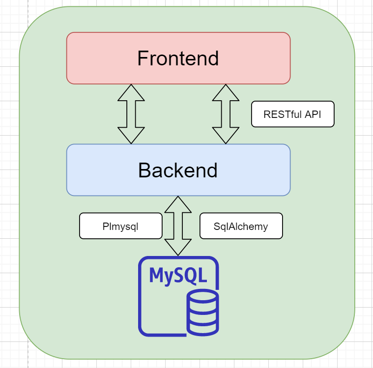

前端技术：

- HTML
- CSS
- Javascript
- ajax

后端

- Flask 框架
- SqlAlchemy + PLMysql 连接数据库
- Flask-cors 解决跨域

### 功能展示

#### 首页

进入项目首页，你会看到如下页面：

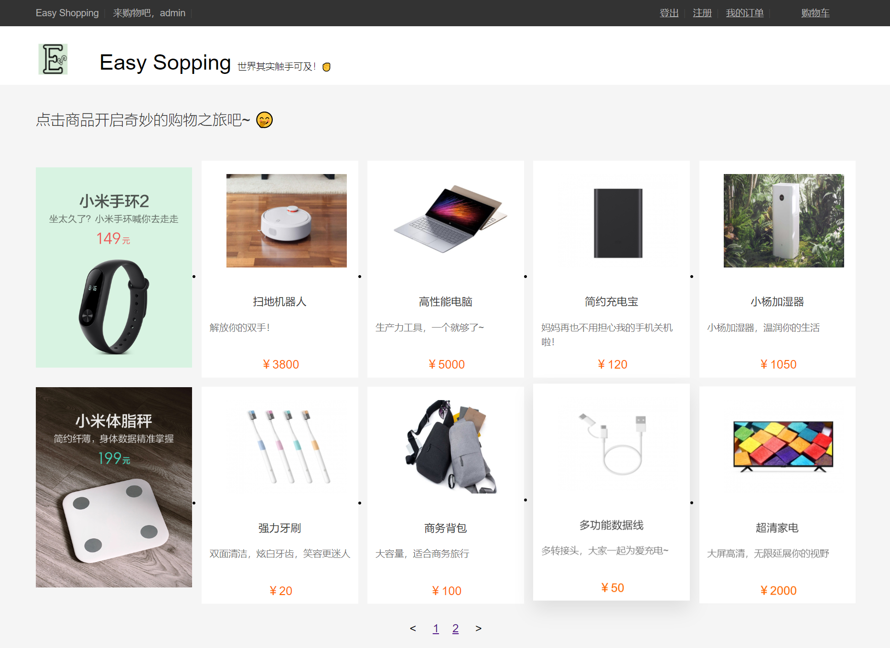

##### 根据登录状态展示不同的欢迎消息

为了提升用户体验，登录和非登录状态下的欢迎消息和按钮显示是不同的：

- 登录状态

  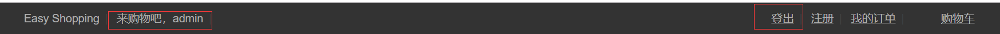

- 登出状态

  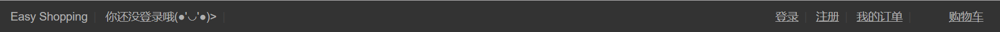

##### 商品展示分页

数据库中共有 13 个产品条目，为了提升友好度和易用性，我做了分页，一页展示 8 个产品。第一页如下：
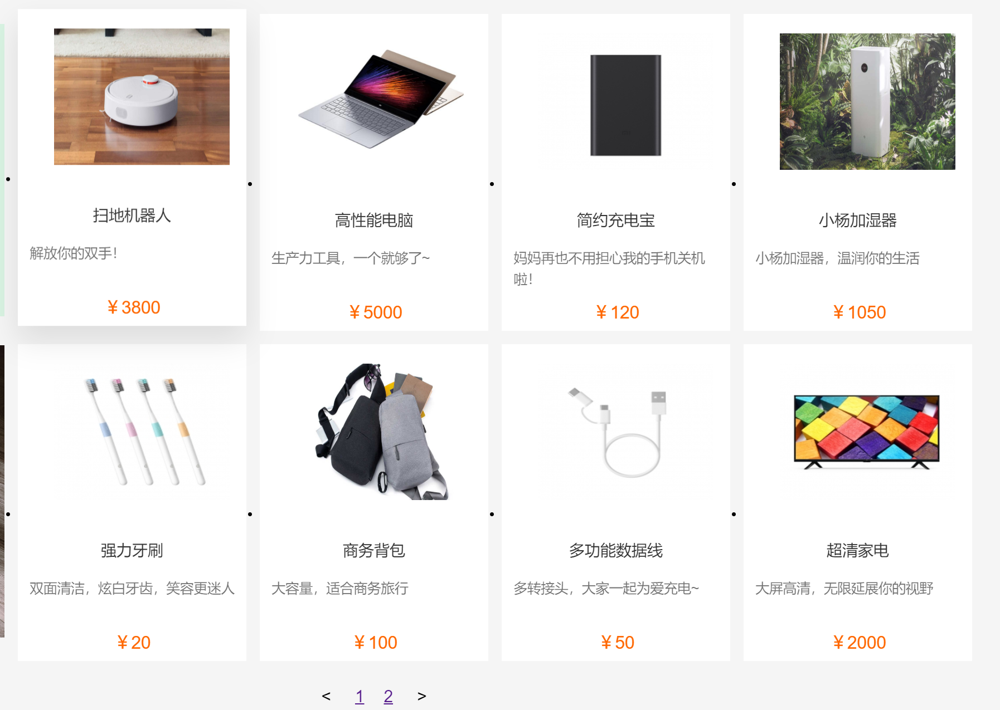

第二页如下：

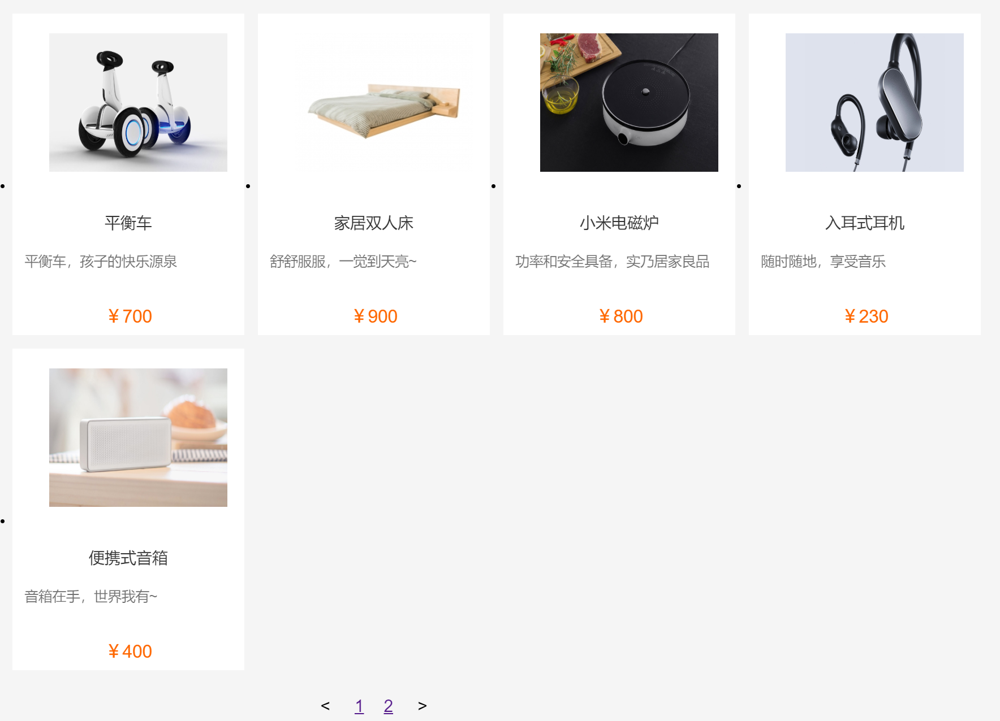

分页也可以有效减少前后端数据的传输，增快网页响应速度。

##### 商品浮动效果

当鼠标移动到产品时，商品会有浮动效果：

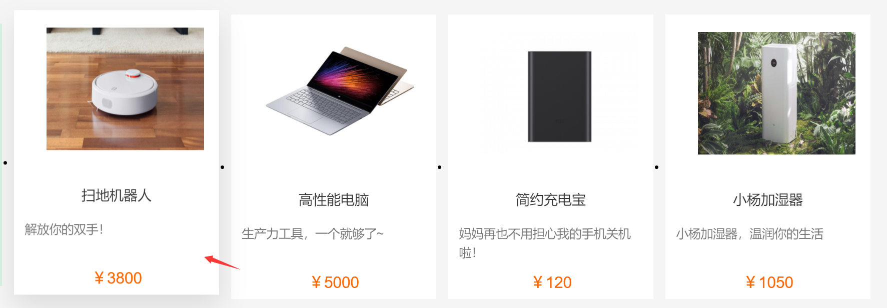

#### 详情页

点击任一产品可以进入详情页，查看商品的具体信息：

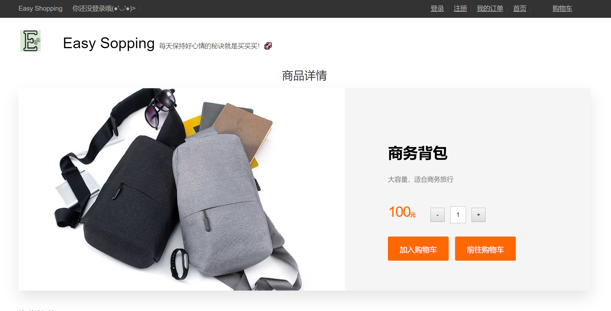

点击加减按钮改变购买数量，确定后即可加入购物车，登录/不登录状态均可加入购物车。加入购物车后会提示用户成功加购：

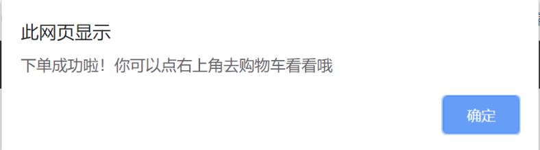

#### 购物车页

加购后可以点击`前往购物车`按钮或者顶层导航栏前往购物车，购物车展示如下：

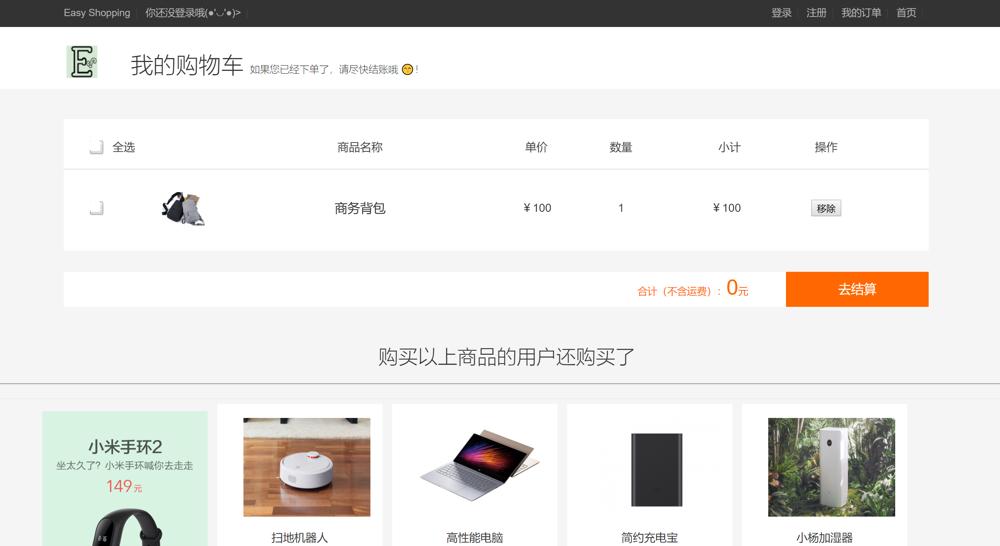

在这里可以进行的操作有：

- 选中某一商品
- 选中全部商品
- 移除某一个购物车中的商品
- 点击结算，结算订单需要处于登录状态
- 点击购物车中的商品图片可以去到商品详情页

当未登录时点击结算按钮，会提示用户未登录：

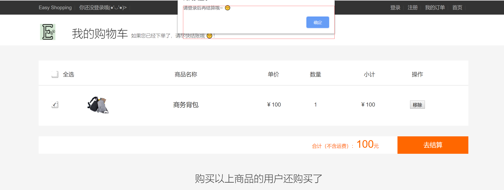

#### 登录和注册

点击右上角的登录或注册按钮，可以去到对应的界面：

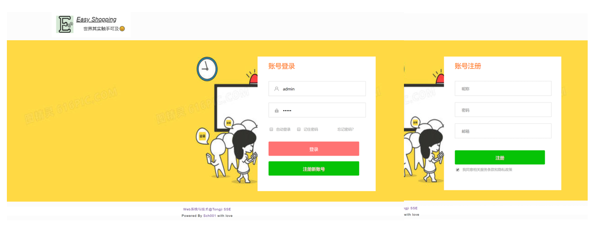

登录后便可以正常进行购物车商品的结算。

#### 订单页

在登录状态下我们可以查看历史订单，我实现了简单的订单状态，分为已付款和未付款：

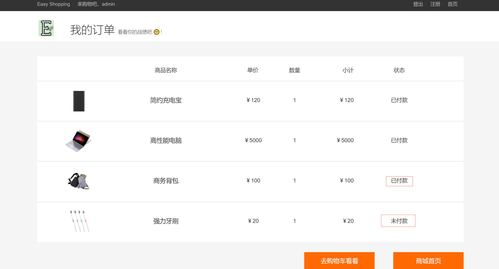

### 接口实现

后端实现了以下接口：

| 接口                        | HTTP Method | 简介               |
| --------------------------- | ----------- | ------------------ |
| /login                      | POST        | 登录               |
| /users                      | POST        | 注册               |
| /products/page/&lt;page&gt; | GET         | 获取某个页面的产品 |
| /products/<pro_id>          | GET         | 获取某个产品详情   |
| /orders/<user_id>           | GET         | 获取用户的订单     |
| /orders/unpaid/<user_id>    | GET         | 获取购物车信息     |
| /orders                     | POST        | 加入购物车         |
| /orders/<orderid>           | POST        | 结算一个商品       |
| /orders/<orderid>           | DELETE      | 移出购物车         |
| /orders/pay                 | POST        | 购物车结算         |

后端在[这里](https://github.com/enochii/ES-Backend)
